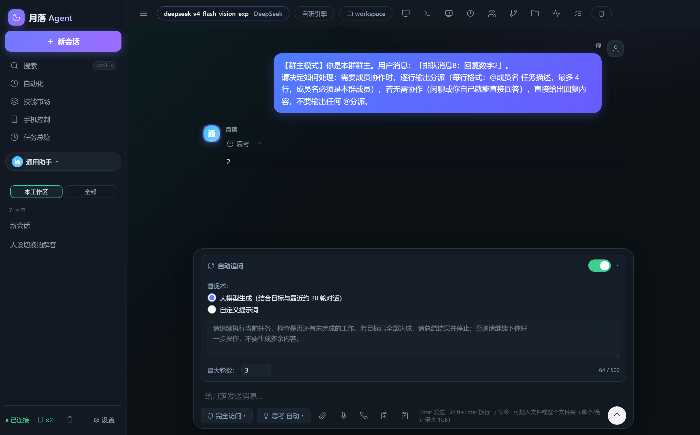
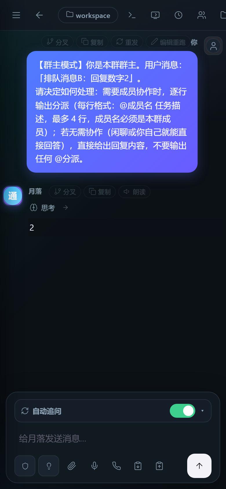
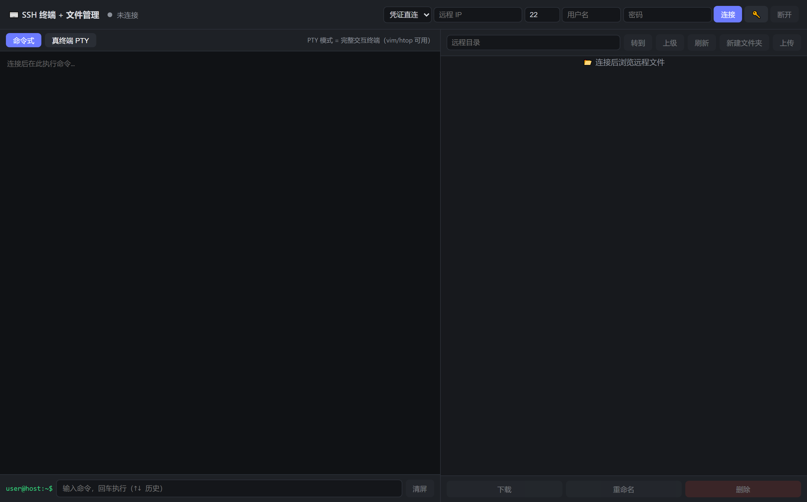

# ☾ 月落 Agent（Yueluo Agent）2.0 稳定版

融合 **[pi](https://github.com/earendil-works/pi)**（earendil-works）、**[hermes-agent](https://github.com/nousresearch/hermes-agent)**（Nous Research）与 **ZCode** 三家精华的自托管智能体。

**后端为 TypeScript + SQLite**（Node 24 原生运行 .ts，零编译），前端纯手写无构建。

一个进程，三种用法：**PC 图形界面**、**手机远程操控**、**REST API**。

数据全部留在你自己的电脑上：不交月费，不上传，不依赖任何第三方 Agent 框架。

---

## ⚠️ 免责声明 / Disclaimer

**本项目仅供学习、研究及合法授权范围内的技术测试使用。**

- 使用者**必须遵守所在国家及地区的法律法规**,包括但不限于《中华人民共和国网络安全法》《中华人民共和国刑法》(第二百八十五条、第二百八十六条)等相关规定
- **严禁**将本项目用于任何违法犯罪活动,包括但不限于:未经授权的网络入侵、攻击他人信息系统、窃取公民个人信息、传播木马病毒、破坏计算机数据等
- 因下载、使用或传播本项目而产生的一切后果与法律责任,**由使用者本人独立承担**,与本项目作者及贡献者无关
- 如果不同意本声明,请立即删除并停止使用本项目

**This project is for educational and research purposes ONLY. Users MUST comply with all applicable local laws and regulations. Any ILLEGAL use of this software is strictly PROHIBITED. Users assume full legal responsibility for their own actions. If you do not agree, delete this project immediately.**

---

## 📷 界面一览

| PC 控制台 | 手机端 |
|---|---|
|  |  |

**SSH 真终端 + 文件管理（PTY 模式，vim / htop 完整可用）**：



---

## ✨ 核心能力

**自主执行引擎**

- 46 个内置工具：终端命令、文件读写、浏览器自动化（Playwright 驱动系统 Edge）、SSH/RDP、语音链路、定时调度、代码执行、语义记忆……
- **自动追问**：回合结束由大模型裁判判定任务是否完成，没完成自动生成督促语继续推进，直到完成或达到轮数上限——治好 AI 的「半途而废」
- steer / followUp 双队列（运行中插话排队，回合结束自动续跑）；僵死回合 10 分钟看门狗强制回收
- 会话树 / 分叉 / 分支切换；子代理委派 delegate_task；后台并行任务；todo 任务清单实时面板
- 自动上下文压缩（超阈值压成摘要）+ `/compact` 手动压缩；思考深度分级（auto/off/低/中/高）

**多模型，多接口，自动适配**

- **31+ 供应商预设**（OpenAI / DeepSeek / Anthropic / Gemini / xAI / Mistral / Cerebras / NVIDIA / Together / MiniMax / OpenRouter / Groq / 本地 Ollama / llama.cpp / LM Studio / 自定义端点……）
- **兼容接口自动适配**：对 Grok2API 类逆向接口、推理类模型、轻量兼容层，自动逐层降级（stream_options → 自定义温度 → tools）并记忆端点特征，后续请求一次直达
- 多 API 模式：openai / openai-responses / anthropic / gemini / mock / auto
- 每个智能体角色可绑定自己的模型与音色

**手机 = 完整指挥台**

- 局域网直连 + 云服务器公网部署 + 内网穿透，任意网络扫码控制
- 与电脑毫秒级同步：工具调用实时直播、命令审批手机上点、PWA 添加到主屏
- **剪贴板互通**（手机 ↔ 电脑双向）、任务完成自动推送（浏览器通知 / 微信 / ntfy）

**远程操控**

- **RDP 远程桌面**（FreeRDP 引擎直连，目标机零安装；双指缩放、单指操控、全键位虚拟键盘）
- **SSH 真终端**（xterm.js + PTY 模式，vim / htop 完整可用）+ 远程文件管理
- **网页文件编辑器**：手机上直接浏览、编辑、保存电脑里的代码文件

**语音全链路**

- Edge-TTS 十种中文音色给角色配音；**10 秒授权音频克隆专属音色**（Fish Audio）
- 语音输入 STT（任意 OpenAI 兼容转写端点）；**语音通话模式**：按住说话 → 识别 → 回答 → 自动朗读 → 下一轮

**知识库（RAG）**

- txt / Markdown / Word / 代码文件上传，自动切块向量化（Embedding 语义召回，未配置时关键词兜底）
- 聊天时自动检索引用最相关段落并注明来源；全部存本机

**群聊多智能体**

- 把多个角色拉进一个群：@谁谁干活、群主自动分派、成员并行执行、中途踢人加人
- 每个角色独立模型、独立音色、独立工作区（压缩包拖入自动构建 + 自动装工具）

**自动化**

- Cron 定时任务（结果实时推所有在线设备）+「早安晨报」一键模板
- 任务完成推送（浏览器通知 / 微信 / ntfy 三通道）

**来源吸收清单（能力明细对照）**

| 能力 | 来源 | 状态 |
|---|---|---|
| 多 API 模式兼容（openai / openai-responses / anthropic / gemini / mock / auto） | hermes api_mode 抽象 | ✅ 实测 |
| **SQLite 存储 + FTS5 中文全文搜索** | hermes fts5_cjk 思路 | ✅ 实测 |
| **Cron 定时任务** + 结果实时推送 | hermes cron | ✅ 实测 |
| **配对码入网**（8 位一次性码免抄 token） | hermes pairing | ✅ 实测 |
| 命令执行前审批（手机点批准/拒绝） | hermes approval | ✅ 实测 |
| **自动追问**（大模型裁判 + 督促链） | 月落原创 | ✅ 实测 |
| **知识库 RAG**（切块向量化 + 自动召回引用） | - | ✅ 实测 |
| **群聊多智能体**（轮流/群主分派/并行池） | - | ✅ 实测 |
| **RDP 远程桌面**（FreeRDP + 打印帧 + 输入注入 + 虚拟键盘） | - | ✅ 实测 |
| **SSH 真终端**（ssh2 PTY + xterm.js）+ SFTP 文件管理 | - | ✅ 实测 |
| **语音通话**（按住说话→STT→TTS→自动下一轮）+ **声音克隆**（10 秒样本） | - | ✅ 实测 |
| **剪贴板互通**（手机 ↔ 电脑）+ **网页文件编辑器** | - | ✅ 实测 |
| **任务完成推送**（浏览器/微信/ntfy）+ **早安晨报模板** | - | ✅ 实测 |
| **兼容接口自动适配**（stream_options/温度/tools 三层降级 + 端点记忆） | - | ✅ 实测 |
| 31+ 供应商预设 + 自定义端点 | 全量提供商 | ✅ 实测 |
| steer / followUp 双队列；自动压缩 + /compact；思考深度分级 | pi | ✅ 实测 |
| 会话树 / 分叉 / 全景图；子代理委派；后台并行；todo 面板 | pi·hermes·ZCode | ✅ 实测 |
| 浏览器自动化（Playwright + 系统 Edge）；运行中终端实时输出 | browser-use / ZCode | ✅ 实测 |
| MCP 客户端（stdio）；Hooks（before/after_tool） | ZCode / hermes | ✅ 实测 |
| 消息网关：Webhook（实测）/ Telegram / 飞书 / 企业微信 / Discord / ntfy | hermes gateway | ✅ 就绪 |
| PWA、多主题背景、深浅色、权限模式切换、失败重试、只读模式 | ZCode | ✅ 实测 |

---

## 📦 下载

> **最新版本:v2.0** —— `YueluoAgent-v2.0.zip`(约 35MB,解压即用)
> 历史版本:v1.0(`YueluoAgent-v1.0.zip`)同在仓库根目录,可按需下载

## 🚀 快速开始

```bat
双击 启动月落.bat
```

或手动：`cd yueluo-agent && npm install && node yueluo.ts`（首次需 `npm install`，仅 playwright-core 等数个依赖）

- 本机自动打开 `http://127.0.0.1:8765`
- 已预配置**DeepSeek**；换模型/供应商点右上「设置」，支持 31+ 预设与任意自定义端点
- 无 API key 时选「月落测试模型」preset 可验证全链路

### 手机远程控制（三步）

1. 双击「启动月落.bat」→ 自动弹出界面
2. 点侧栏「📱 手机控制」→ 弹出**二维码**（已携带访问令牌，扫码免输入）+ 局域网地址 + 访问令牌
3. 手机扫码 → 远程对话、执行命令、批准命令——**与电脑实时同步**

> ⚠️ 令牌/配对码勿外传；手机连不上时放行防火墙：`netsh advfirewall firewall add rule name="YueluoAgent" dir=in action=allow protocol=TCP localport=8765`

## 🌐 公网部署（手机随处扫码控制）

部署到云服务器（或内网穿透）后，手机**不连同一 Wi-Fi 也能扫码控制**：

1. 服务器上 `node yueluo.ts`（云服务器安全组/防火墙放行 8765；Linux 下 `bash start.sh` 或用 `linux/yueluo.service` 注册 systemd）
2. `~/.yueluo/config.json` 填 **`public_url`**（如 `https://yl.example.com` 或 `http://你的公网IP:8765`）并重启
   → 界面里的二维码、手机面板地址、启动横幅**全部自动切到公网地址**
3. 手机扫码（任意网络）→ 输入令牌/配对码 → 远程控制

本机不出机房？内网穿透即可：`cloudflared tunnel --url http://localhost:8765` 或 frp/花生壳，把得到的公网地址填进 `public_url`。

**公网安全清单（务必）**：

- [x] 访问强制令牌（公网永不免鉴权，本机免鉴权仅限 127.0.0.1）——已内置
- [x] 登录/配对码防爆破限速（60 秒 10 次失败锁定）——已内置
- [x] 隐身模式（未授权访问只返回 404，不暴露服务存在）——已内置
- [ ] **上 HTTPS**：HTTP 明文会暴露 token，用 nginx/caddy 证书反代，或 `cloudflared tunnel` 自带 HTTPS
- [ ] token 不要发给别人；泄露后在 `~/.yueluo/config.json` 换一个重启
- [ ] 可开「命令审批」开关，手机上逐条批准 agent 的命令

## 📡 消息网关（外部平台入口）

| 平台 | 状态 | 接入方式 |
|---|---|---|
| **Webhook** | ✅ 全链路实测 | config 填 `gateway.webhook_secret` → `POST /api/gateway/webhook?secret=*** {"text":"...","chat_id":"u1"}` 返回 agent 回复 |
| **Telegram** | ✅ 适配器就绪 | config 填 `gateway.telegram_token`（+ `telegram_allowed_chats` 白名单）重启即长轮询 |
| **飞书** | ✅ 握手已实测 | 开放平台自建应用，事件订阅地址填 `http://<公网地址>/api/gateway/feishu` |
| **企业微信** | ✅ 握手已实测 | 自建应用 `gateway.wecom`，回调 `/api/gateway/wecom`，需公网可达 |
| **Discord** | ✅ 适配器就绪 | 填 `gateway.discord_token` 即用（WebSocket 直连无需公网；默认前缀 `!yl`） |
| **ntfy** | ✅ 适配器就绪 | 免费无凭据：填 `gateway.ntfy_topic`，手机装 ntfy App 即对话即推送 |
| **个人微信** | ✅ 官方 iLink 通道 | @wechatbot/wechatbot SDK 扫码登录，多机器人独立实例；语音条能听能说 |
| **个人微信（逆向方案）** | ⚠ 风险自担 | 微信不提供个人号机器人 API，逆向方案有封号风险，请用上方官方通道或企业微信 |

## 🎛 界面

- **左栏**：会话列表 + 全文搜索（中文可搜）、新会话、连接状态、在线设备数 📱、设置
- **顶栏**：模型徽标、引擎徽标、工作目录徽标（点击切换工作区）、内置预览、SSH、RDP、定时任务、群聊、会话树、调用轨迹、todo、任务推送
- **消息流**：Markdown 渲染、💭 思考过程、🛠 工具卡片（实时输出流）、活动时间线（一轮 ≥4 步自动折叠）
- **输入区**：Enter 发送 / Shift+Enter 换行；`/` 命令面板；📎 附件（图片走视觉）；🎤 语音输入；📞 语音通话；📋 剪贴板互通；**自动追问面板**
- **🎨 主题**：月夜/午夜蓝/暗林/暖阳/晨雾/樱花/极光 + 自定义配色与背景图，多端同步

## 🔌 MCP 与 Hooks

```json
"mcp_servers": {
  "filesystem": { "command": "npx", "args": ["-y", "@modelcontextprotocol/server-filesystem", "C:\\data"] }
},
"hooks": {
  "before_tool": "<命令；$env:YUELuo_HOOK 含工具 JSON，非零退出=拦截>",
  "after_tool": "<事后通知/审计>"
}
```

## 📦 打包 / 分发

```bat
node scripts\pack.mjs
```

生成干净发行目录与 zip；**目标机器只需 Node.js ≥ 22.5（推荐 24）**，解压后 `npm install` 再启动。浏览器自动化复用系统 Edge/Chrome，无需下载浏览器。

## 🏗 架构

```
yueluo.ts            入口（横幅/MCP装载/cron启动/服务监听）
src/
  config.ts    配置（JSON 深合并）
  db.ts        SQLite（node:sqlite）：sessions/messages/cron/groups/kb + FTS5 中文搜索
  providers.ts 多API适配（openai/openai-responses/anthropic/gemini/mock + 兼容层自动降级）
  tools.ts     内置工具 + Hooks 执行器
  browser.ts   浏览器自动化（playwright-core 驱动系统 Edge）
  extras.ts    剪贴板互通 / 任务推送 / 知识库RAG / SSH PTY 终端
  agent.ts     AgentApp（派发/自动追问/记忆与知识库召回）、AgentRun（工具循环/审批/压缩）
  groups.ts    群聊多智能体（轮流/群主分派/并行池/微信绑定）
  tasks.ts     后台任务持久化；cron.ts 定时调度；memory.ts 语义记忆
  rdp_win.ts   RDP（FreeRDP + 帧捕获 + 输入注入）；ssh_exec/ssh_sftp.ts SSH 执行与文件
  voice_clone.ts 声音克隆（Fish Audio）；stt.ts 语音识别；tts_edge.ts Edge-TTS
  wechat_bot.ts 微信机器人（官方 iLink，多实例）；gateway.ts 消息网关
  server.ts    node:http：REST + SSE + 静态 + 鉴权（含 /xterm 终端资源）
web/            前端（无构建无CDN，移动端自适应；含 xterm 终端页）
skills/         预置技能；linux/  Linux 端服务与升级脚本
```

数据目录 `~/.yueluo/`：`yueluo.db`、`config.json`、`prompts/`、`memory.md`、`uploads/`、`voices/`。

## 📌 路线图

- **语音唤醒**与连续对话 VAD 断句（当前为按住说话模式）
- **computer-use 屏幕级精细操控**（浏览器自动化已内置）
- **MCP 资源/提示词/采样**子集（tools 已就绪）
- **多用户隔离**（当前单用户 + 设备授权模型）

---

*自托管 · 数据不上传 · 手机远程 · Windows / Linux 双平台*
